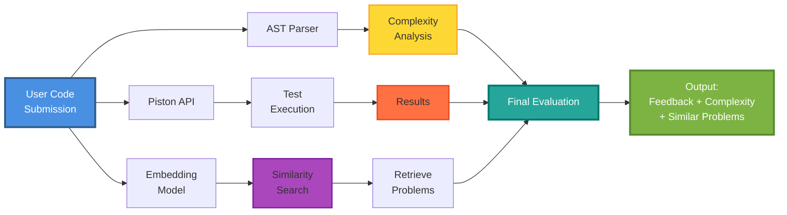

# Intelligent Code Evaluation Platform

An AI-powered code evaluation system that analyzes user-submitted Python code using AST-based complexity analysis, test-case execution, and RAG-based similarity retrieval to provide deep, actionable feedback.

---

## 🚀 Overview

Unlike traditional judging systems that only output pass/fail, this platform evaluates code like an AI mentor. It:

- Runs your code safely using an execution sandbox
- Detects time complexity using Abstract Syntax Trees (AST)
- Finds similar problems using vector embeddings
- Suggests improvements using optimal solutions retrieved via RAG

**You get meaningful insights, not just results.**

---

## ✨ Features

### 🔍 1. Code Execution (Piston API)
- Automatically extracts the function name
- Generates wrapper code
- Executes with test cases
- Returns output, errors, or mismatches

### 🧠 2. AST-Based Complexity Analysis
Uses Python's `ast` module to inspect structural patterns:
- Loop depth → time complexity
- Nested loops detection
- Pattern-based recursion detection
- Maps structure to complexities like O(n), O(n²), O(n³)

### 🔎 3. RAG-Powered Similar Problem Retrieval
- Uses `all-MiniLM-L6-v2` (SentenceTransformer)
- Retrieves most similar problems using cosine similarity
- Compares user's complexity with optimal complexity
- Suggests improvements + shows optimal solution

### 📚 4. Streamlit Frontend
Interactive UI to:
- Paste code
- Add custom test cases
- View complexity
- See improvements
- Explore similar problems

---

## 🏗️ Architecture Diagram



---

## 🛠️ Technology Stack

| Component | Technology |
|-----------|-----------|
| **Execution** | Piston API |
| **Frontend** | Streamlit |
| **RAG** | SentenceTransformer (MiniLM) |
| **Vector Search** | SciPy (cosine similarity) |
| **Complexity Analysis** | Python `ast` |
| **Language** | Python |

---

## 📌 How It Works (Step-by-Step)

1. **User submits code + test cases**
2. **System extracts function name automatically**
3. **Piston API runs the code**
4. **AST module calculates time complexity**
5. **MiniLM embeds the code/problem**
6. **Similar problems are retrieved**
7. **If user's code is suboptimal → improvements shown**
8. **Results displayed in Streamlit UI**

---

## 🔗 Demo (Live Deployment)

👉 **[Try it Live](https://intelligent-code-evaluator-git-6dgrkqmljukg3ti5t2h9w5.streamlit.app)**

---

## 📦 Installation

```bash
git clone https://github.com/YOUR_USERNAME/Intelligent-Code-Evaluator
cd Intelligent-Code-Evaluator

pip install -r requirements.txt
streamlit run app.py
```

---

## 📁 Project Structure

```
intelligent-code-evaluator/
├── app.py                      # Main Streamlit application
├── src/
│   ├── ast_analyzer.py         # AST parsing & complexity analysis
│   ├── code_executor.py        # Piston API integration
│   ├── embeddings.py           # Code embedding generation
│   └── rag_retrieval.py        # Similar problem retrieval
├── data/
│   ├── problems.json           # Problem dataset
│   └── embeddings.pkl          # Pre-computed embeddings
├── requirements.txt            # Dependencies
├── .gitignore
└── README.md
```

---

## 🎯 Use Cases

- **Students**: Get detailed feedback on coding assignments beyond just "wrong answer"
- **Interview Prep**: Understand complexity trade-offs in real-time
- **Educators**: Provide automated, intelligent code reviews at scale
- **Self-Learners**: Learn optimal approaches by comparing with similar problems

---

## 🧪 Example Usage

### Input:
```python
def two_sum(nums, target):
    for i in range(len(nums)):
        for j in range(i+1, len(nums)):
            if nums[i] + nums[j] == target:
                return [i, j]
```

### Output:
- **Execution**:  Passed all test cases
- **Complexity**: O(n²) time, O(1) space
- **Similar Problem**: Two Sum (Hash Map approach)
- **Optimal Complexity**: O(n) time, O(n) space
- **Suggestion**: "Use a hash map to store seen values for O(n) solution"

---

## 🚀 Key Highlights

✅ **Beyond Test Cases**: Analyzes code structure, not just outputs  
✅ **RAG-Powered**: Retrieves similar problems for context-aware feedback  
✅ **AST Analysis**: Objective complexity estimation without execution  
✅ **Safe Execution**: Sandboxed environment via Piston API  
✅ **Interactive UI**: Easy-to-use Streamlit interface  

---

## 🤝 Contributing

Contributions are welcome!

1. Fork the repo
2. Create a new branch (`git checkout -b feature/amazing-feature`)
3. Commit your changes (`git commit -m 'Add amazing feature'`)
4. Push to the branch (`git push origin feature/amazing-feature`)
5. Open a Pull Request

---

## 📝 Roadmap

- [ ] Support for JavaScript, Java, C++
- [ ] LeetCode/Codeforces API integration
- [ ] Custom problem sets for educators
- [ ] Real-time collaborative code review
- [ ] Performance benchmarking dashboard

---


⭐ **If you find this project helpful, please give it a star!** ⭐
